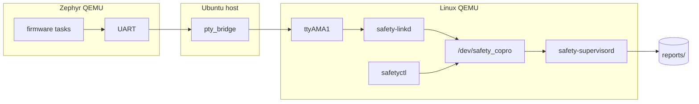
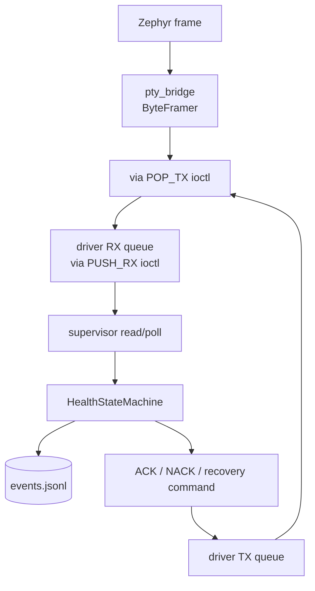
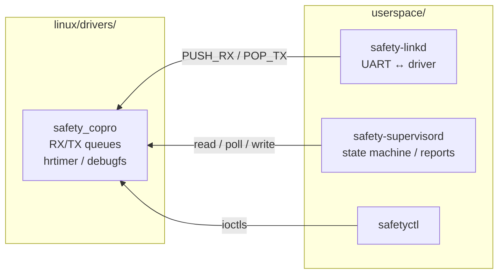
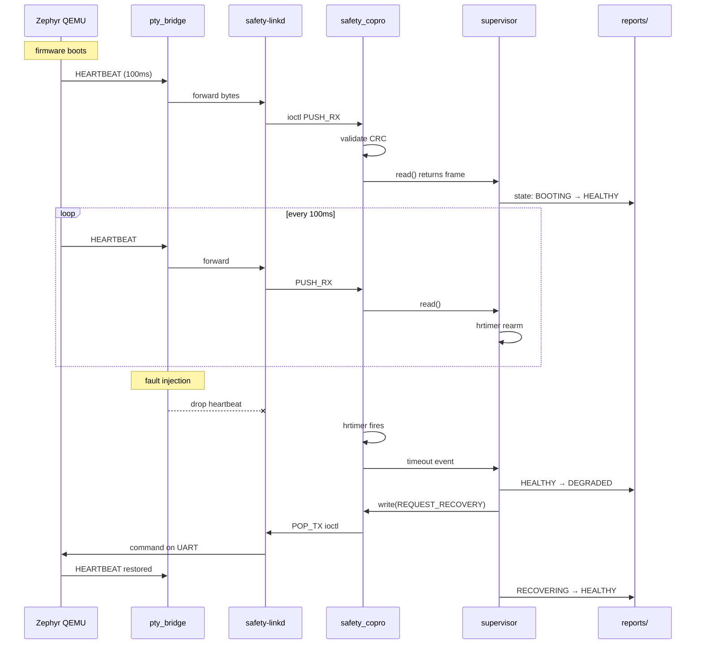
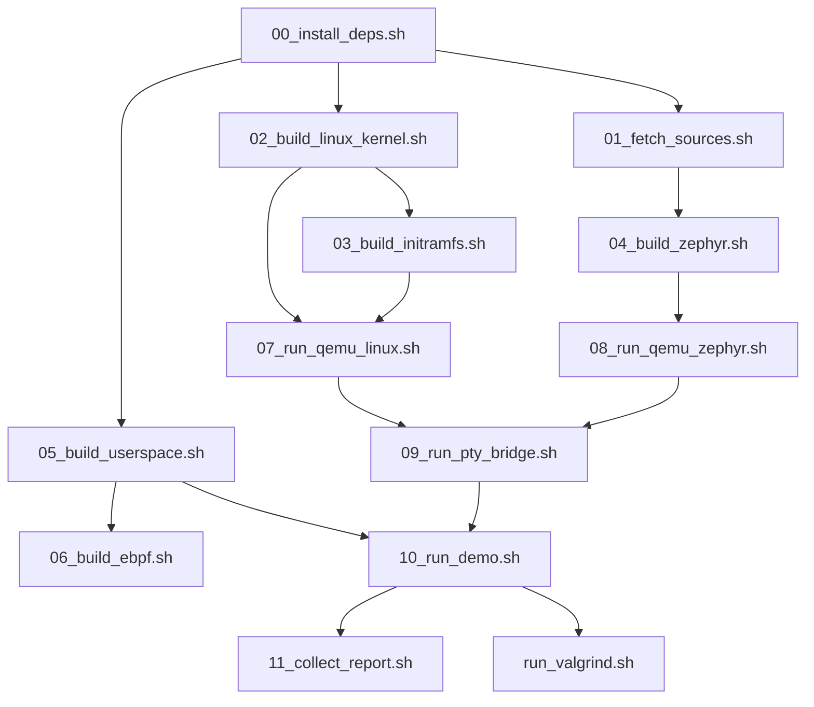

# Real-Time Safety Co-Processor Supervisor

Ubuntu 24.04 上跑的 embedded Linux / Zephyr RTOS 安全協處理器監控系統。整條資料流長這樣：

```text
Zephyr QEMU UART
  -> host pty_bridge
  -> Linux QEMU ttyAMA1
  -> safety-linkd
  -> /dev/safety_copro
  -> safety-supervisord
  -> reports/
```

## 專案概述

| 元件 | 原始碼路徑 | 做的事 |
| -- | -- | -- |
| Protocol | `include/safety_protocol.h` | frame 格式、CRC-32、command/fault 定義 |
| Zephyr firmware | `zephyr/safety_copro_firmware/` | 送 heartbeat/telemetry、收 command、回報 fault |
| PTY bridge | `bridge/` | 在兩個 QEMU 的 UART 之間轉送資料，可灌 drop/delay/corrupt |
| Linux driver | `linux/drivers/safety_copro/` | `/dev/safety_copro`，收 frame、排 TX、算 timeout |
| `safety-linkd` | `userspace/safety-linkd/` | 把 `/dev/ttyAMA1` 接上 driver 的 adapter |
| `safety-supervisord` | `userspace/safety-supervisord/` | 讀 driver、解析 frame、管 state machine、寫 reports |
| `safetyctl` | `userspace/safetyctl/` | 下指令看狀態、灌 fault、觸發 recovery |

## 功能範圍

| 類別 | 內容 |
| -- | -- |
| Frame type | `HEARTBEAT`, `TELEMETRY`, `FAULT_EVENT`, `COMMAND`, `ACK`, `NACK`, `RECOVERY_REPORT` |
| Command | `GET_STATUS`, `INJECT_FAULT`, `REQUEST_RECOVERY`, `ENTER_SAFE_MODE`, `RESET_FAULT_STATE` |
| Fault 種類 | `heartbeat_stop`, `checksum_error_response`, `critical_fault` |
| Demo | baseline（host only）、heartbeat-timeout（E2E）、checksum-error（E2E） |
| Optional | eBPF tracing agent（需要目標 kernel 的 BTF 和 tracepoints） |

目前沒做的東西列在 [`docs/future-work.md`](docs/future-work.md)。

## 目錄結構

```text
├── bridge/              PTY bridge
├── docs/                文件
├── ebpf/                eBPF tracing（optional）
├── include/             canonical protocol header
├── linux/
│   └── drivers/safety_copro/  kernel driver，built-in
├── scripts/             建置/執行 script（00-11, run_valgrind, 99）
├── tests/               Python unittest
├── userspace/
│   ├── safety-linkd/    UART ↔ driver
│   ├── safety-supervisord/   state machine + report
│   ├── safetyctl/       CLI 工具
│   └── common/          protocol header 的一份 copy
├── zephyr/
│   └── safety_copro_firmware/ Zephyr firmware（formal + debug）
├── build/               編譯產物，不進 git
└── reports/             執行報告，不進 git
```

## 系統架構（System Architecture）



三個 VM（host、Zephyr QEMU、Linux QEMU）＋ 一套 driver/userspace。沒有 socket、database、Web server。

## 資料流（Data Flow）



supervisor 只從 `/dev/safety_copro` 讀資料，不碰 UART。linkd 只搬資料不碰 state。

## 模組關係（Module Relationship）



## 唯一個 pipeline：啟動到 shutdown

這張圖把整條路徑從頭到尾走一次：Zephyr 通電 → 送 HEARTBEAT → bridge 轉送 → linkd 收 → driver 驗證 → supervisor 判 state → 寫 report。



## 建置流程（Build Process）

### 需要的環境

| 套件 | 版本 |
| -- | -- |
| Ubuntu | 24.04 LTS |
| cmake | >= 3.20 |
| ninja | >= 1.10 |
| python3 | >= 3.10 |
| gcc-aarch64-linux-gnu | >= 12 |
| gcc (host) | >= 12 |

### 安裝工具

```sh
sudo ./scripts/00_install_deps.sh
```

裝完長這樣：

```text
cmake: 3.28.3
ninja: 1.11.1
python: 3.12.3
gcc (host): 13.3.0
gcc-aarch64-linux-gnu: 13.3.0
qemu-system-aarch64: 8.2.2
[ OK ] Host dependencies installed.
```

### 最快驗證：host userspace

如果只是想確認 code 能不能編、test 會不會過：

```sh
./scripts/05_build_userspace.sh host
PYTHONDONTWRITEBYTECODE=1 python3 -m unittest discover -s tests -v
```

成功輸出：

```text
==== Checking protocol header copies ====
[ OK ] Protocol headers are synchronized.
==== Building userspace (host) ====
[100%] Built target safetyctl
[ OK ] Host userspace built. Binaries:
       build/userspace/bin/safety-linkd
       build/userspace/bin/safety-supervisord
       build/userspace/bin/safetyctl
       build/userspace/bin/pty_bridge
```

### 全部 script



| Script | 產物 |
| -- | -- |
| `00_install_deps.sh` | host packages |
| `01_fetch_sources.sh` | `build/deps/zephyrproject`, `build/tools/zephyr-sdk` |
| `02_build_linux_kernel.sh` | `build/linux/arch/arm64/boot/Image` |
| `03_build_initramfs.sh` | `build/initramfs/rootfs.cpio.gz` |
| `04_build_zephyr.sh` | `build/zephyr.elf`, `build/zephyr-debug.elf` |
| `05_build_userspace.sh` | `build/userspace/bin/*` |
| `06_build_ebpf.sh` | `ebpf/safety-trace` 或 not verified |
| `07_run_qemu_linux.sh` | `build/run/linux_uart_pty.txt` |
| `08_run_qemu_zephyr.sh` | `build/run/zephyr_uart_pty.txt` |
| `09_run_pty_bridge.sh` | bridge forwarding |
| `10_run_demo.sh` | `reports/events.jsonl` |
| `11_collect_report.sh` | `reports/verification.md` |
| `run_valgrind.sh` | `reports/valgrind_report.txt` |
| `99_cleanup.sh` | 清掉 build/ 和 reports/ |

## 執行流程（Run Process）

### Host mock / replay

不需要 QEMU、kernel、ARM64 cross compiler，只要 host build 過就能跑。

```sh
mkdir -p reports
./build/userspace/bin/safety-supervisord --mock-device tests/fixtures/fault_log.bin --report-dir reports
./build/userspace/bin/safety-supervisord --replay reports/events.jsonl --report-dir reports
```

mock 會用預錄的 fault log 餵 state machine，replay 用剛剛產出的 events.jsonl 再跑一次。兩個最後都會印 `final state: HEALTHY`。

### Valgrind

```sh
./scripts/run_valgrind.sh
```

前提是 `reports/events.jsonl` 不為空（跑過 mock/replay 就會有）。報告在 `reports/valgrind_report.txt`。

### QEMU + bridge（full E2E）

如果 toolchain 和 artifact 都齊了，可以依序跑：

```sh
./scripts/02_build_linux_kernel.sh        # 產 kernel Image
BUSYBOX=/path/to/aarch64/busybox ./scripts/03_build_initramfs.sh  # 產 initramfs
./scripts/07_run_qemu_linux.sh            # 啟動 Linux QEMU
./scripts/01_fetch_sources.sh             # 準備 Zephyr workspace
./scripts/04_build_zephyr.sh formal       # 產 firmware
./scripts/08_run_qemu_zephyr.sh           # 啟動 Zephyr QEMU
./scripts/09_run_pty_bridge.sh            # 串起來
./scripts/10_run_demo.sh heartbeat-timeout  # 跑 E2E demo
```

QEMU PTY 路徑會自動寫到 `build/run/` 下，bridge script 會讀那個檔來決定要連哪個 PTY。

### 清理

```sh
./scripts/99_cleanup.sh
```

刪掉 `build/` 和 `reports/`。source code 和 git history 不動。

## Demo

### baseline（host only）

```sh
./scripts/10_run_demo.sh baseline
```

等價於手動跑 mock + replay + Valgrind。輸出：

```text
==== Baseline demo ====
[ OK ] supervisor mock final state: HEALTHY
[ OK ] supervisor replay final state: HEALTHY
[ OK ] Valgrind: no leaks
==== Done ====
```

產物：

```
reports/events.jsonl
reports/replay_events.jsonl
reports/valgrind_report.txt
```

### heartbeat-timeout（E2E，需要 dual QEMU）

bridge 每 5 個 HEARTBEAT drop 一次，driver 的 hrtimer 會 timeout，觸發 DEGRADED → RECOVERING → HEALTHY 循環。

```sh
./scripts/10_run_demo.sh heartbeat-timeout
```

預期 events.jsonl 裡出現：

```text
{"kind": "state_change", "from": "HEALTHY", "to": "DEGRADED"}
{"kind": "state_change", "from": "DEGRADED", "to": "RECOVERING"}
{"kind": "state_change", "from": "RECOVERING", "to": "HEALTHY"}
```

### checksum-error（E2E，需要 dual QEMU）

bridge 每 7 個 frame corrupt 一個 byte，driver 偵測到 CRC 錯就丟掉 frame、送 NACK，Zephyr 重送。

```sh
./scripts/10_run_demo.sh checksum-error
```

預期看到 protocol_error_count 增加、bridge log 裡有 corrupted frame 記錄、Zephyr 收到 NACK 後重傳。

---

heartbeat-timeout 和 checksum-error 在缺少 QEMU PTY 檔案時會跳 `[SKIP] not verified`，不會報成功。

## 設定檔說明

| 檔案 | 用途 |
| -- | -- |
| `zephyr/safety_copro_firmware/prj.conf` | formal build：SMP + UART interrupt、關 console/printk/log/shell |
| `zephyr/safety_copro_firmware/prj_debug.conf` | debug build：開 shell 和 logging（UART 會被污染） |
| `linux/configs/qemu_arm64_safety_defconfig` | kernel defconfig fragment，開 `CONFIG_SAFETY_COPRO=y`、BTF、debugfs |

## 疑難排解

| 症狀 | 檢查 |
| -- | -- |
| protocol 不一致 | 跑一次 `05_build_userspace.sh host`，它會比對 4 份 header |
| reports 開不出來 | `mkdir -p reports` |
| ARM64 BusyBox 找不到 | `BUSYBOX=/path/to/aarch64/busybox` |
| Zephyr build 卡 SDK | 先跑 `01_fetch_sources.sh`，確認 SDK minimal install |
| eBPF attach 失敗 | 要在目標 kernel（有 `safety_copro` tracepoints）上跑，host 不行 |
| QEMU PTY 沒產生 | 確認 `build/run/` 存在，沒有別的 process 卡住 QEMU |

## 限制

host userspace build、python tests、mock/replay、Valgrind 都已經驗證過。剩下的 Linux kernel build、Zephyr SDK、dual-QEMU、eBPF runtime 需要本機有對應的 toolchain 或 artifact；環境不足時一律標 `not verified`，不會假裝通過。
