# 架構與資料流

整條 pipeline 只有一條路：Zephyr 送 frame 出來，經過 pty_bridge、linkd、driver，最後到 supervisor 做決策。每個環節各司其職，不互相代勞。

## System Architecture

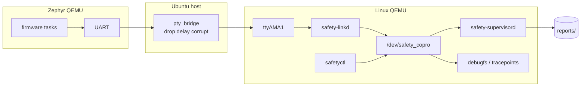

對應 source：`bridge/`、`userspace/safety-linkd/`、`linux/drivers/safety_copro/`、`userspace/safety-supervisord/`。圖上沒有 socket、database、Web 元件，因為實際就沒有。

## Data Flow

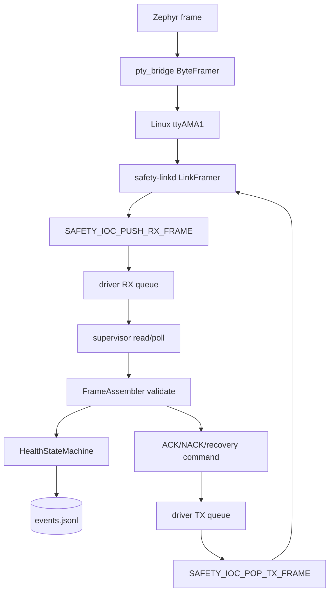

supervisor 只讀 `/dev/safety_copro`，不碰 UART。linkd 只搬資料，不管 state。

## 狀態機（State Machine）

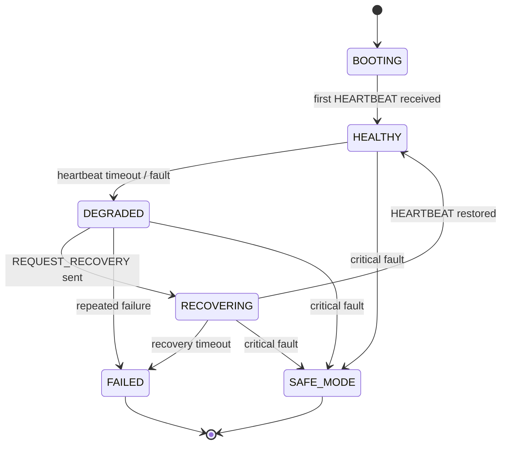

實作在 `userspace/safety-supervisord/health_state_machine.cpp`。bridge、linkd、driver 都不碰 state。

## 啟動流程（Boot Sequence）

Zephyr 通電後，依序拉起四條 task，heartbeat task 最先開始送 frame。

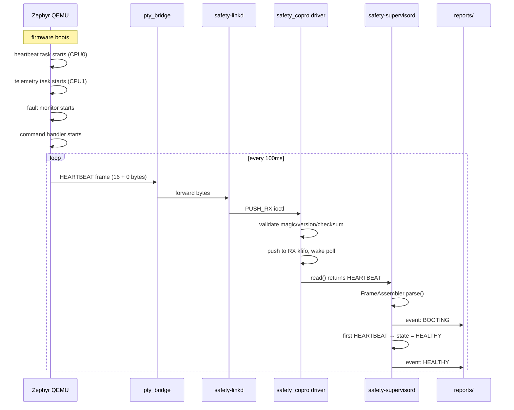

第一個 HEARTBEAT 讓 supervisor 從 BOOTING 轉 HEALTHY。之後每 100ms 的 HEARTBEAT 會重設 driver 的 hrtimer，不讓 timeout 觸發。

## Heartbeat 超時流程（Heartbeat Timeout Sequence）

pty_bridge 故意丟掉或延遲 HEARTBEAT 時，driver 的 hrtimer 會觸發。

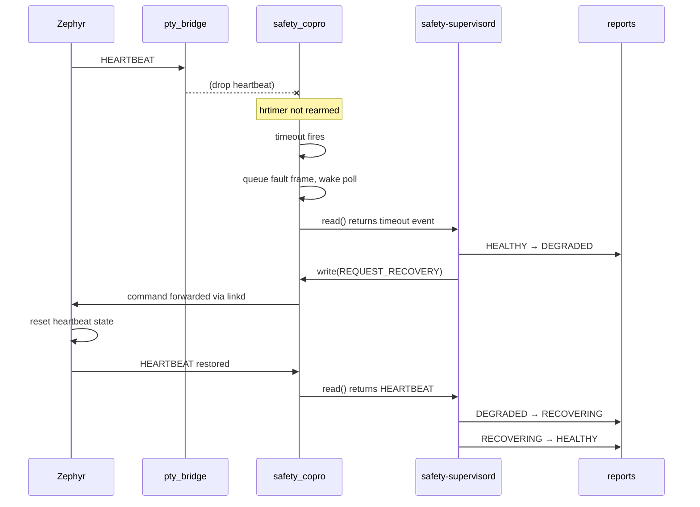

`--drop-type 1` 指定只丟 HEARTBEAT frame。整個週期完成後，reports 裡會有一組 `DEGRADED → RECOVERING → HEALTHY` 事件鏈。

## Checksum 錯誤流程（Checksum Error Sequence）

pty_bridge 用 `--corrupt` 隨機翻轉 byte 來模擬線路雜訊。

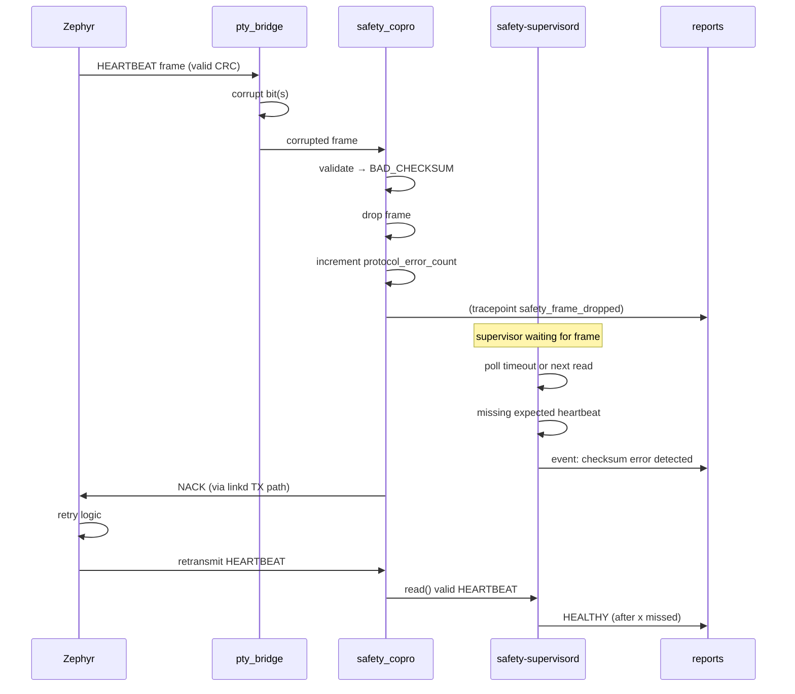

這種 case 在 `--corrupt 7 --corrupt-type 1` 下測試：每 7 個 HEARTBEAT 就翻轉一次。

## Heartbeat 時序（Timing Diagram）

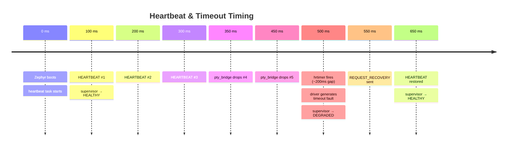

driver 的 hrtimer timeout 預設值決定了多少次 missed HEARTBEAT 才算超時。實際間隔可透過 `SAFETY_IOC_SET_HB_TIMEOUT_MS` 調整。

## Kernel Driver 內部（Kernel Driver Call Flow）

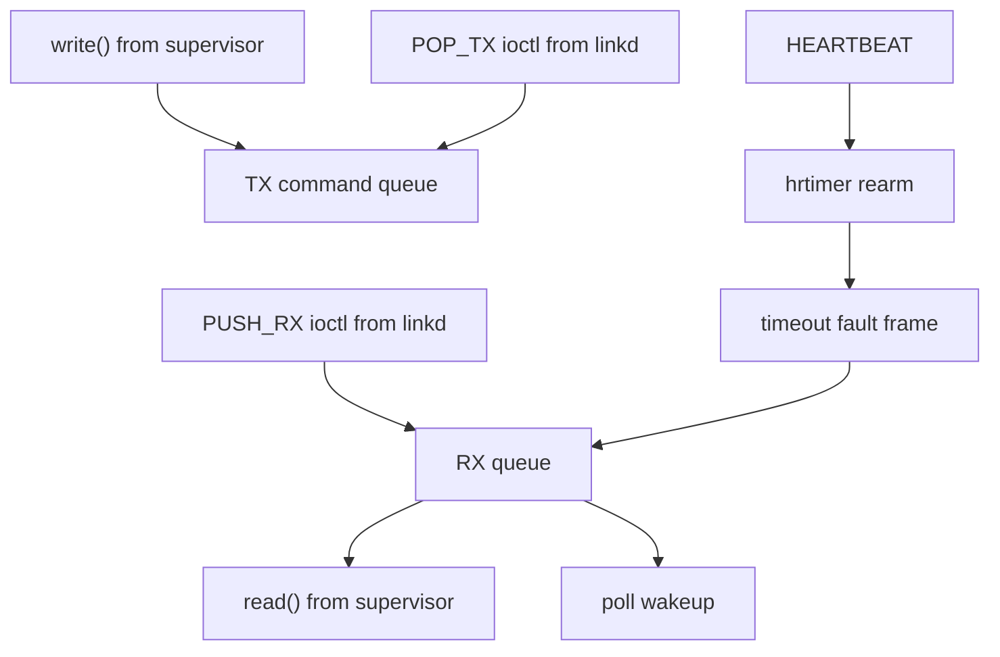

driver source 在 `linux/drivers/safety_copro/`。裡面用到 miscdevice、kfifo、wait queue、hrtimer、workqueue、debugfs、tracepoint。

## Zephyr Task 互動（Zephyr Task Interaction）

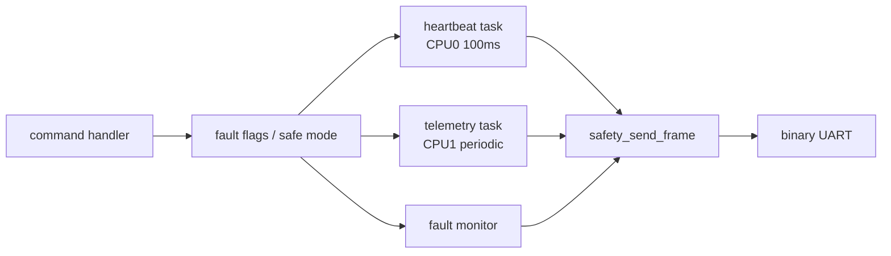

Formal `prj.conf` 關掉 console、UART console、printk、log、shell，確保 UART 只走 protocol frame。Debug config 可以開 shell/logging，但那不是 formal demo 的預設。

## 建置依賴（Build Dependency）

執行 script 前先確認前置產物在不在，沒有的話會跳過或標 not verified。

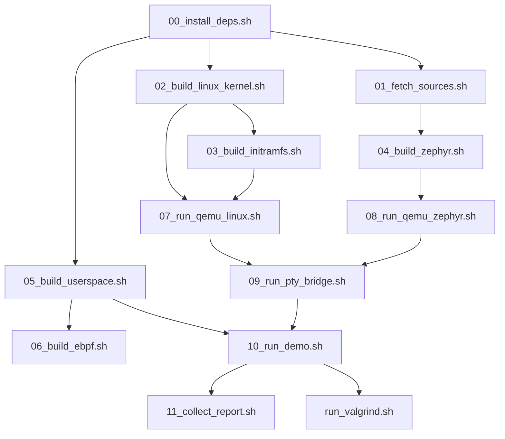

`05_build_userspace.sh` 不依賴 kernel 或 Zephyr build，是 host 上最快的驗證路徑。

## eBPF Tracing

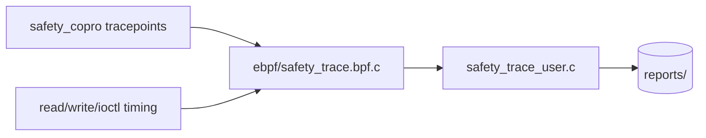

eBPF 是 optional，不影響 baseline build。它必須跑在含 BTF 和 `safety_copro` tracepoints 的目標 kernel 上；host kernel attach 會標 `not verified`。

## 整條 pipeline 的相依元件

這張圖把 runtime 的 process 和它們開啟的檔案列出來，方便除錯時釐清哪個 process 讀哪個 device。

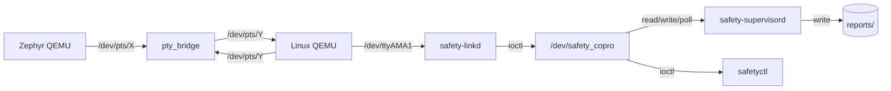

QEMU 的 PTY path 每次啟動不一定相同，所以 script 執行時會把 PTY 編號寫到 `build/run/` 下的文字檔。
