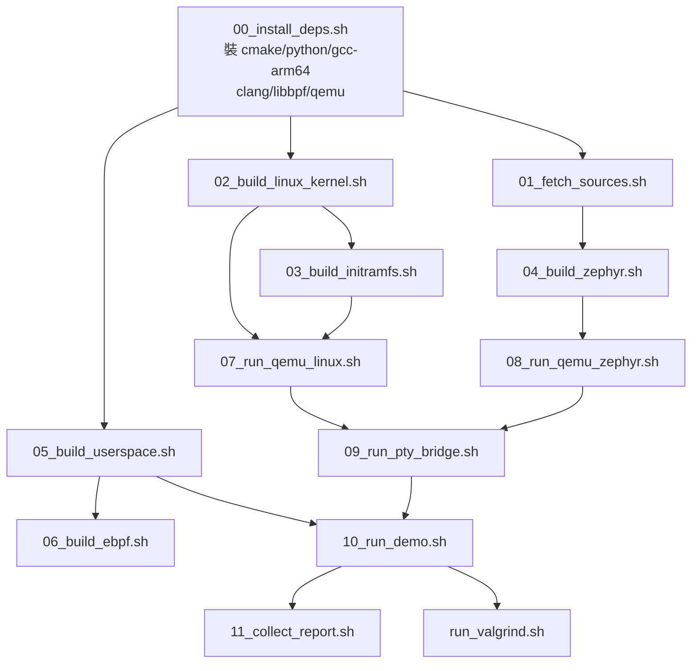

# 建置與執行

這份文件把建置和執行的步驟一條條列出來。所有 terminal output 都是英文。

## 建置依賴



箭頭表示「需要前置產物」。`05_build_userspace.sh` 是最獨立的，不需要 kernel、Zephyr、或 QEMU，第一次 checkout 後可以先跑這個驗證 toolchain。

## Script 一覽

| Script | 用途 | 主要產物 | 前置條件 |
| -- | -- | -- | -- |
| `00_install_deps.sh` | 裝 Ubuntu 24.04 的相依套件 | host packages | 無（apt-get） |
| `01_fetch_sources.sh` | 準備 Zephyr v4.4.0 workspace | `build/deps/zephyrproject` | 00 |
| `02_build_linux_kernel.sh` | 建 ARM64 kernel + built-in driver | `build/linux/arch/arm64/boot/Image` | 00 |
| `03_build_initramfs.sh` | 做 BusyBox initramfs | `build/initramfs/rootfs.cpio.gz` | 需指定 AArch64 BusyBox |
| `04_build_zephyr.sh` | 建 Zephyr firmware（formal/debug） | `build/zephyr.elf` | 01, Zephyr SDK |
| `05_build_userspace.sh` | 建 C++17 userspace + bridge | `build/userspace/bin/*` | 00 |
| `06_build_ebpf.sh` | eBPF（optional） | `ebpf/safety-trace` 或 not verified | clang, bpftool |
| `07_run_qemu_linux.sh` | 啟動 Linux QEMU | `build/run/linux_uart_pty.txt` | 02, 03 |
| `08_run_qemu_zephyr.sh` | 啟動 Zephyr QEMU | `build/run/zephyr_uart_pty.txt` | 04 |
| `09_run_pty_bridge.sh` | 串兩個 QEMU PTY | bridge forwarding | 07, 08 |
| `10_run_demo.sh` | 跑 baseline 或 E2E demo | `reports/events.jsonl` | 05 + 可能 09 |
| `11_collect_report.sh` | 產 verification 報告 | `reports/verification.md` | 無（掃 artifacts） |
| `run_valgrind.sh` | replay-only Valgrind | `reports/valgrind_report.txt` | 10 |
| `99_cleanup.sh` | 清 build/ 和 reports/ | 清空目錄 | 無 |

## 建置流程

### 第一步：裝工具

```sh
sudo ./scripts/00_install_deps.sh
```

這會裝 cmake、ninja、python3、gcc-aarch64-linux-gnu、clang、libbpf-dev、qemu-system-aarch64 等。成功時印出各工具版本：

```text
==== Installing host dependencies ====
cmake: 3.28.3
ninja: 1.11.1
python: 3.12.3
gcc (host): 13.3.0
gcc-aarch64-linux-gnu: 13.3.0
clang: 18.1.3
qemu-system-aarch64: 8.2.2
[ OK ] Host dependencies installed.
```

### 第二步：建 userspace（最快驗證）

```sh
./scripts/05_build_userspace.sh host
```

如果只看 host 端能不能 work，這一步 + python tests 就夠了。QEMU、Zephyr SDK、ARM64 BusyBox 都不需要。

成功輸出：

```text
==== Checking protocol header copies ====
[ OK ] Protocol headers are synchronized.
==== Building userspace (host) ====
-- Configuring done (0.1s)
-- Generating done (0.8s)
[100%] Built target safetyctl
[ OK ] Host userspace built. Binaries:
       build/userspace/bin/safety-linkd
       build/userspace/bin/safety-supervisord
       build/userspace/bin/safetyctl
       build/userspace/bin/pty_bridge
```

如果 protocol header 不同步，script 會直接 exit 1，並提示 `cmp` 出錯的檔案：

```text
==== Checking protocol header copies ====
[FAIL] include/safety_protocol.h and userspace/common/safety_protocol.h differ!
```

修法：把 `include/safety_protocol.h` 複製到三個 consumer copy。

### 第三步：建 ARM64 userspace（cross compile）

```sh
./scripts/05_build_userspace.sh arm64
```

這會用 `aarch64-linux-gnu-g++` 編出 ARM64 版 binary。產物一樣在 `build/userspace/bin/`，但副檔名或目錄會區分。如果系統沒有 ARM64 cross toolchain，00_install_deps.sh 會裝。

### 第四步：建 Linux kernel

```sh
./scripts/02_build_linux_kernel.sh
```

這一步需要 ARM64 cross toolchain。會從 kernel.org 下載 Linux 6.12.y tarball（如果 `build/linux/` 不存在），然後用 `linux/configs/qemu_arm64_safety_defconfig` 疊在 defconfig 上。成功後產 `build/linux/arch/arm64/boot/Image`。

如果沒有 ARM64 cross compiler，script 會先跳錯。如果 kernel source 已經存在則跳過下載。

### 第五步：準備 Zephyr

```sh
./scripts/01_fetch_sources.sh
```

下載 Zephyr v4.4.0 到 `build/deps/zephyrproject/`，建立 Python venv 裝 west。SDK 部分只做 minimal install 探測，不會自動下載整套 SDK。SDK 驗證沒過時標 not verified。

### 第六步：建 Zephyr firmware

```sh
./scripts/04_build_zephyr.sh formal
```

需要 west 和 Zephyr SDK。如果 west 不在 PATH 或 SDK 沒裝，script 會寫 not verified 但不擋後續步驟。

debug 版：

```sh
./scripts/04_build_zephyr.sh debug
```

debug 版啟用 shell 和 logging，UART 會被污染，不適合拿來跑 formal demo。

### 第七步：建 initramfs

```sh
BUSYBOX=/path/to/aarch64/busybox ./scripts/03_build_initramfs.sh
```

**注意**：host 上的 `/usr/bin/busybox` 是 x86-64 binary，不能用。必須指定 AArch64 版本的 BusyBox。如果沒給或檔案不對，script 會回報 not verified。

產物：`build/initramfs/rootfs.cpio.gz`。

### 第八步：建 eBPF（optional）

```sh
./scripts/06_build_ebpf.sh
```

需要 clang、bpftool、libbpf-dev。如果缺東西，script 會標 not verified 而非報錯。

---

## 執行流程

### Host mock/replay

這條路徑不需要任何 QEMU 或 kernel，適合開發時快速驗證 state machine 和 report 輸出。

```sh
mkdir -p reports
./build/userspace/bin/safety-supervisord --mock-device tests/fixtures/fault_log.bin --report-dir reports
```

成功時 terminal 最後一行：

```text
[2026-01-01 00:00:10] supervisor final state: HEALTHY
```

然後 replay 同一個 report：

```sh
./build/userspace/bin/safety-supervisord --replay reports/events.jsonl --report-dir reports
```

replay 會重新餵一次 events.jsonl 給 state machine，產出 `reports/replay_events.jsonl`。可以用來驗證 state machine 的行為和當時一致。

```text
[2026-01-01 00:00:10] replay final state: HEALTHY
```

### Valgrind

```sh
./scripts/run_valgrind.sh
```

前提是 `reports/events.jsonl` 非空。Valgrind 跑 replay mode，追 memory leak。報告寫到 `reports/valgrind_report.txt`。

```text
== valgrind report ==
HEAP SUMMARY:
    in use at exit: 0 bytes in 0 blocks
```

### 啟動兩個 QEMU

Linux QEMU（需要 kernel Image + initramfs）：

```sh
./scripts/07_run_qemu_linux.sh
```

script 會把 ttyAMA1 的 PTY path 寫到 `build/run/linux_uart_pty.txt`，內容像 `pts/5`。

Zephyr QEMU（需要 firmware elf）：

```sh
./scripts/08_run_qemu_zephyr.sh
```

UART PTY path 寫到 `build/run/zephyr_uart_pty.txt`。

兩個 QEMU 都啟動後，可以用 `09_run_pty_bridge.sh` 把它們串起來。

### 啟動 bridge

```sh
./scripts/09_run_pty_bridge.sh
```

bridge 會讀兩個 PTY file，決定兩邊的 PTY 編號，然後開始轉送 frame。

加上 fault injection：

```sh
# 每 5 個 frame 丟一個
BRIDGE_ARGS="--drop 5 --drop-type 1" ./scripts/09_run_pty_bridge.sh

# 每 7 個 frame corrupt 一次
BRIDGE_ARGS="--corrupt 7" ./scripts/09_run_pty_bridge.sh

# 每個 frame 延遲 50ms
BRIDGE_ARGS="--delay-ms 50" ./scripts/09_run_pty_bridge.sh
```

bridge 的 log 用 `--log` 指定：

```sh
BRIDGE_ARGS="--log reports/bridge.csv" ./scripts/09_run_pty_bridge.sh
```

### 清理

```sh
./scripts/99_cleanup.sh
```

刪掉 `build/` 和 `reports/` 底下的 generated artifacts。原始碼不動。

---

## Demo

### baseline

最快也最基本的 demo：用 mock device 餵一段預錄的 fault log，看 supervisor 的 state machine 把整個 lifecycle 跑一遍。

```sh
./scripts/10_run_demo.sh baseline
```

script 做的事情：

1. `mkdir -p reports`
2. 跑 `safety-supervisord --mock-device tests/fixtures/fault_log.bin --report-dir reports`
3. 跑 `safety-supervisord --replay reports/events.jsonl --report-dir reports`
4. 跑 `run_valgrind.sh`

預期 terminal 輸出：

```text
==== Baseline demo ====
[ OK ] supervisor mock final state: HEALTHY
[ OK ] supervisor replay final state: HEALTHY
[ OK ] Valgrind: no leaks
==== Done ====
```

產出的 report：

```text
reports/events.jsonl
reports/replay_events.jsonl
reports/valgrind_report.txt
```

### heartbeat-timeout

需要兩個 QEMU 和 bridge 都跑起來。bridge 設 `--drop 5 --drop-type 1`，每 5 個 HEARTBEAT 丟一個，讓 driver hrtimer 超時。

```sh
./scripts/10_run_demo.sh heartbeat-timeout
```

預期 events.jsonl 裡出現：

```text
{"kind": "state_change", "from": "HEALTHY", "to": "DEGRADED", ...}
{"kind": "state_change", "from": "DEGRADED", "to": "RECOVERING", ...}
{"kind": "state_change", "from": "RECOVERING", "to": "HEALTHY", ...}
```

如果 QEMU PTY 不存在，script 會寫 `[SKIP] not verified` 而不是報錯。

### checksum-error

bridge 設 `--corrupt 7` 隨機翻轉 frame 內容。

```sh
./scripts/10_run_demo.sh checksum-error
```

預期 bridge 的 log 看到 corrupted frame 被 driver 丟棄，protocol_error_count 增加，Zephyr 收到 NACK 後重送。

---

## 疑難排解

| 症狀 | 檢查 |
| -- | -- |
| protocol mismatch | `./scripts/05_build_userspace.sh host` 會做 `cmp` |
| reports 目錄不存在 | `mkdir -p reports` |
| ARM64 BusyBox 找不到 | 設 `BUSYBOX=/path/to/aarch64/busybox` |
| Zephyr build 失敗在 SDK | 先跑 `01_fetch_sources.sh`，確認 SDK minimal install |
| QEMU PTY 沒產生 | 檢查 `build/run/` 有沒有被別隻 script 鎖住 |
| Valgrind 報 leak | 看 `reports/valgrind_report.txt`，如果 leak 在 libc 通常是 false positive |
| bridge 連不上 PTY | 確認兩個 QEMU 都在跑，`build/run/` 下的 PTY file 內容正確 |
